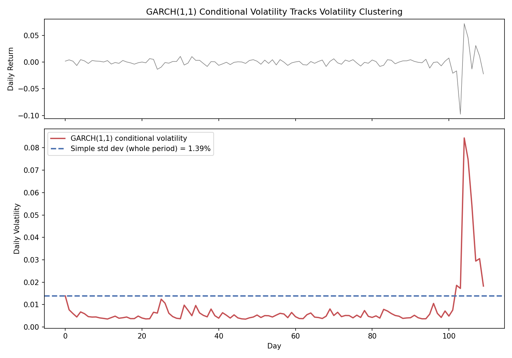

# GARCH(1,1) Volatility & VaR Calculator

A Python implementation of the GARCH(1,1) model — the standard time series model for
volatility clustering in financial returns — with parameters estimated via maximum
likelihood, used to compute a volatility-adjusted VaR.

## Why GARCH?

[EWMA](https://github.com/ducksmell-sys/ewma-calculator) improves on a simple moving
average by weighting recent data more heavily, but its decay factor (λ) is fixed by
convention (e.g. 0.94), not estimated from the data — and it has no mechanism to pull
volatility back toward a long-run average.

GARCH(1,1) fixes both issues. It's a proper time series model, in the same family as
ARIMA but built to model *variance* instead of the mean:

```
σ²_t = ω + α · r²_(t-1) + β · σ²_(t-1)
```

- `ω` (omega): anchors volatility to a long-run average — `ω / (1 - α - β)`
- `α` (alpha): how strongly yesterday's shock feeds into today's volatility
- `β` (beta): how persistent volatility is over time
- All three are estimated from the data itself via **maximum likelihood estimation (MLE)**,
  not assumed

Developed by Tim Bollerslev (1986), building on Robert Engle's ARCH model (1982 Nobel
Prize in Economics, 2003). GARCH(1,1) remains the industry-standard baseline for
volatility forecasting in market risk management.

## Methodology

1. **Fit**: given a return series, find the `(ω, α, β)` that maximize the likelihood of
   observing that data, under the assumption `r_t = σ_t · z_t`, `z_t ~ N(0,1)`
2. **Forecast**: use the fitted parameters to compute tomorrow's conditional variance
   from today's return and today's variance estimate
3. **VaR**: apply the standard parametric VaR formula using the GARCH-forecasted
   volatility instead of a simple historical standard deviation

## Files

| File | Description |
|---|---|
| `garch_calculator.py` | Core GARCH(1,1) functions (`fit_garch`, `garch_volatility`, `garch_var`) — demo runs on synthetic data |
| `garch_calculator_data.py` | Loads real data by ticker (via yfinance) or CSV, fits GARCH(1,1), and compares simple vs. GARCH VaR |
| `garch_general_calculator.py` | Generalized GARCH(p,q) for arbitrary lag orders — see [README_general.md](README_general.md) |
| `gjr_garch_calculator.py` | GJR-GARCH(1,1) with asymmetric leverage effect — see [README_gjr.md](README_gjr.md) |
| `egarch_calculator.py` | EGARCH(1,1), log-variance based asymmetric model — see [README_egarch.md](README_egarch.md) |

## Usage

```bash
pip install numpy pandas scipy yfinance matplotlib

# Run the core module on synthetic demo data (calm period + volatility shock)
python garch_calculator.py

# Run on real market data
python garch_calculator_data.py --ticker AAPL
python garch_calculator_data.py --ticker BTC-USD --confidence 0.99
python garch_calculator_data.py --csv prices.csv --price-col Close
```

Use the functions directly with your own return series:

```python
from garch_calculator import fit_garch, garch_volatility, garch_var

params = fit_garch(returns)                     # {"omega": ..., "alpha": ..., "beta": ...}
garch_volatility(returns, params)                # tomorrow's forecasted volatility
garch_var(returns, confidence=0.95, portfolio_value=1_000_000, params=params)
```

Note: as with the EWMA and VaR calculators in this series, a zero mean return is
assumed — standard practice for short-horizon (1-day) risk estimation.

## Sample Output

The demo simulates 100 calm days followed by 10 high-volatility days:

```
Estimated GARCH(1,1) parameters: omega=0.00000897, alpha=0.7379, beta=0.2483
alpha + beta = 0.9862 (closer to 1 = shocks persist longer)

Simple std dev (whole period, equal weight): 1.3926%
GARCH(1,1) next-day forecasted volatility:   2.1305%

Confidence 90% | Simple VaR: 17,847.45 | GARCH VaR: 27,304.08
Confidence 95% | Simple VaR: 22,906.74 | GARCH VaR: 35,044.07
Confidence 99% | Simple VaR: 32,395.85 | GARCH VaR: 49,561.08
```

### Real data example

```
$ python garch_calculator_data.py --ticker AAPL

Data range: 2024-09-26 ~ 2026-09-25 (501 trading days)
Estimated GARCH(1,1) parameters: omega=0.00001602, alpha=0.0913, beta=0.8593
alpha + beta = 0.9505

Simple std dev: 1.8148% | GARCH(1,1) next-day forecasted volatility: 1.4123%

1-Day VaR at 95% confidence, $1,000,000 portfolio
  Simple VaR : 29,851.08
  GARCH VaR  : 23,230.20
```

Typical equity GARCH(1,1) fits land around α ≈ 0.05–0.10 and β ≈ 0.85–0.90, with
α + β close to (but below) 1 — indicating volatility shocks are highly persistent but
still mean-reverting in the long run.



The top panel shows the simulated returns (100 calm days, then a 10-day shock). The bottom panel shows the GARCH(1,1) conditional volatility: it stays low during the calm period, spikes sharply as the shock arrives, and decays afterward, while the simple standard deviation is a single flat line that misses all of this.
