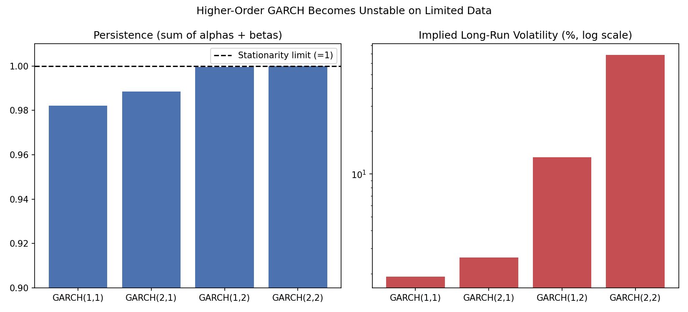

# General GARCH(p,q) Calculator

An extension of [`garch_calculator.py`](garch_calculator.py) that generalizes GARCH(1,1)
to arbitrary orders GARCH(p, q), where the model can look back further than a single
lag for both the shock (ARCH) and variance (GARCH) terms.

## The General Model

```
σ²_t = ω + Σ(i=1 to q) αᵢ·ε²_(t-i) + Σ(j=1 to p) βⱼ·σ²_(t-j)
```

- `q`: how many past squared shocks (`ε²`) the model looks back on
- `p`: how many past variance estimates (`σ²`) the model looks back on
- GARCH(1,1) is the special case `p = q = 1` — see [`garch_calculator.py`](garch_calculator.py)

Stationarity requires the generalized persistence condition:
```
Σαᵢ + Σβⱼ < 1
```
and the long-run (unconditional) variance generalizes to:
```
σ̄² = ω / (1 - Σαᵢ - Σβⱼ)
```

## Why GARCH(1,1) Is Still the Standard

This calculator exists mainly to make an empirical point: **higher-order GARCH models
rarely improve on GARCH(1,1) in practice**, and can become unstable with limited data.
The GARCH(1,1) recursion already implicitly weights the infinite past (geometrically
decaying, same idea as EWMA), so adding more lags mostly adds estimation noise rather
than real explanatory power.

## Files

| File | Description |
|---|---|
| `garch_general_calculator.py` | `fit_garch(returns, p, q)`, `garch_volatility`, `garch_var`, `long_run_variance` — works for any (p, q) |

## Usage

```bash
pip install numpy scipy matplotlib
python garch_general_calculator.py
```

```python
from garch_general_calculator import fit_garch, garch_volatility, garch_var, long_run_variance

params = fit_garch(returns, p=2, q=1)          # GARCH(2,1)
garch_volatility(returns, params, p=2, q=1)     # tomorrow's forecasted volatility
garch_var(returns, confidence=0.95, portfolio_value=1_000_000, params=params, p=2, q=1)
long_run_variance(params)                        # ω / (1 - Σα - Σβ)
```

## Sample Output

The demo simulates 150 calm days followed by 15 high-volatility days, and fits four
different model orders to the same data:

```
모형           잔류율(Σα+Σβ)       다음날 변동성        장기평균 변동성         VaR(95%)
GARCH(1,1)  0.9821           2.1658%        1.8990%          35,625.28
GARCH(2,1)  0.9885           1.9684%        2.5932%          32,378.76
GARCH(1,2)  0.9996           3.1708%        13.1299%         52,157.27
GARCH(2,2)  1.0000           3.1312%        68.4932%         51,505.67
```

Notice what happens as more lags are added: the persistence (`Σα + Σβ`) creeps toward
1, and the implied long-run volatility becomes wildly unrealistic (68% for GARCH(2,2),
versus the ~1–2% that's actually plausible for this data). This is the overfitting
instability higher-order GARCH models are prone to with limited sample sizes — exactly
why GARCH(1,1) remains the industry default rather than a simplification of convenience.



Left: persistence (sum of alphas and betas) creeps up to the stationarity limit of 1 as lags are added. Right (log scale): the implied long-run volatility explodes for the higher-order fits, from about 1.9% for GARCH(1,1) to roughly 68% for GARCH(2,2).
