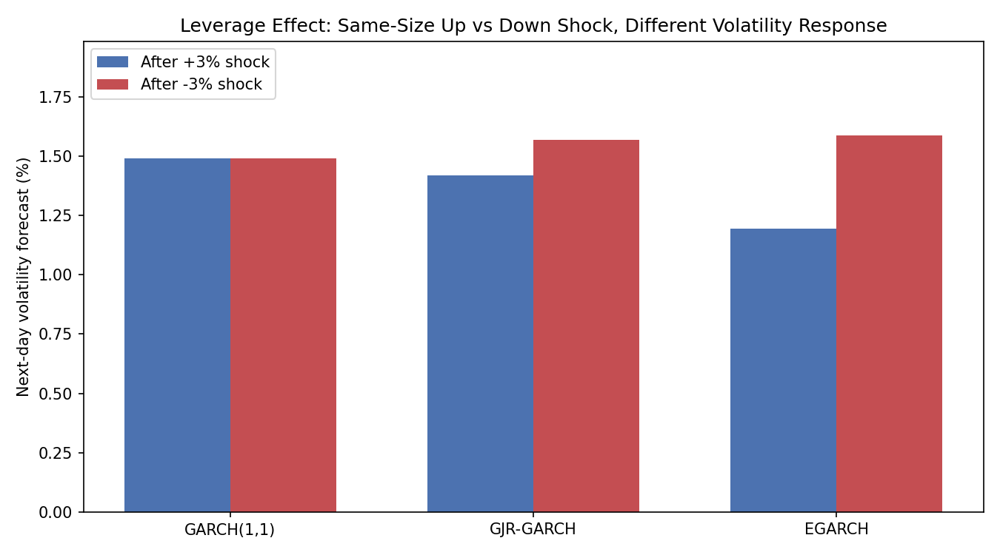
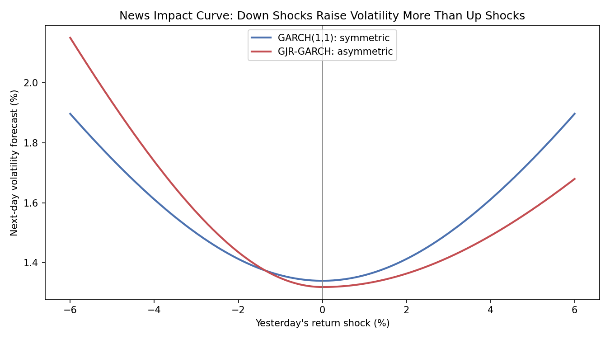

# GJR-GARCH(1,1) Calculator — Asymmetric Volatility (Leverage Effect)

An extension of [`garch_calculator.py`](garch_calculator.py) that captures the
**leverage effect**: the well-documented tendency for negative returns to increase
future volatility more than positive returns of the same magnitude.

## Why Asymmetric GARCH?

Standard GARCH(1,1) uses `α·ε²_(t-1)` — a squared term, so a -3% day and a +3% day
feed into tomorrow's variance forecast identically. But empirically, bad news tends to
spike volatility more than equally-sized good news (a crash feels different from a
rally of the same size). GJR-GARCH (Glosten, Jagannathan, Runkle, 1993) fixes this
with one extra term.

## The Model

```
σ²_t = ω + α·ε²_(t-1) + γ·I_(t-1)·ε²_(t-1) + β·σ²_(t-1)

I_(t-1) = 1 if ε_(t-1) < 0 (yesterday was a down day), else 0
```

- On an **up day**: variance gets `α·ε²` (same as standard GARCH)
- On a **down day**: variance gets `(α+γ)·ε²` — an extra `γ·ε²` kick
- `γ > 0` and statistically significant ⇒ evidence of a leverage effect
- `γ = 0` ⇒ reduces exactly to standard GARCH(1,1)

Stationarity condition (under the normal-innovations assumption, where `E[I]=0.5`):
```
α + β + γ/2 < 1
```

## Files

| File | Description |
|---|---|
| `gjr_garch_calculator.py` | `fit_gjr_garch`, `gjr_volatility`, `gjr_var` — demo directly compares symmetric vs. asymmetric response to identical-size shocks |

## Usage

```bash
pip install numpy scipy matplotlib
python gjr_garch_calculator.py
```

```python
from gjr_garch_calculator import fit_gjr_garch, gjr_volatility, gjr_var

params = fit_gjr_garch(returns)              # {"omega", "alpha", "gamma", "beta"}
gjr_volatility(returns, params)               # tomorrow's forecasted volatility
gjr_var(returns, confidence=0.95, portfolio_value=1_000_000, params=params)
```

## Sample Output

The demo generates synthetic data with a built-in asymmetric response, then asks: *if
yesterday's return had instead been +3% vs. -3% (identical magnitude, opposite sign),
how would each model's volatility forecast differ?*

```
GJR-GARCH estimated parameters: omega=0.00000989, alpha=0.0300, gamma=0.0500, beta=0.8500
(a positive gamma means down-shocks amplify volatility more - leverage effect present)

모델           +3% 충격 후 변동성         -3% 충격 후 변동성         차이
GARCH(1,1)   1.4901%              1.4901%              0.00%p (symmetric, identical)
GJR-GARCH    1.4180%              1.5687%              0.15%p (down day pushes vol higher)
```

GARCH(1,1) is blind to the sign of the shock — identical forecasts either way. GJR-GARCH
correctly produces a higher volatility forecast after the down day, exactly reproducing
the leverage effect built into the simulated data.



GARCH(1,1) gives identical forecasts after a +3% and a -3% shock; GJR-GARCH separates them, and EGARCH separates them even more.

### News impact curve



This is the standard way to visualize asymmetric volatility. Holding yesterday's variance fixed, it plots tomorrow's forecasted volatility against the size of yesterday's shock. GARCH(1,1) (blue) is a symmetric parabola, so a -6% and a +6% day produce the same forecast. GJR-GARCH (red) is steeper on the left: the same -6% shock pushes forecasted volatility to about 2.1%, versus about 1.7% after a +6% shock.
